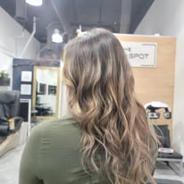

# Hair Art by Martha - Professional Hairstylist Website

A modern, responsive website for a professional hairstylist featuring beautiful animations, interactive elements, and a clean design.

## Features

- **Responsive Design**: Works perfectly on desktop, tablet, and mobile devices
- **Modern UI/UX**: Clean, professional design with smooth animations
- **Interactive Portfolio**: Filterable gallery with hover effects
- **Contact Form**: Functional contact form with validation
- **Mobile Navigation**: Hamburger menu for mobile devices
- **Smooth Scrolling**: Enhanced user experience with smooth page navigation
- **Loading Animations**: Intersection Observer for scroll-triggered animations
- **Progress Indicator**: Visual scroll progress bar
- **Typography**: Beautiful fonts from Google Fonts (Playfair Display & Poppins)

## Project Structure

```
hairartbymartha/
├── index.html          # Main HTML file
├── styles.css          # CSS styles and responsive design
├── script.js           # JavaScript functionality
├── README.md           # Project documentation
└── public/             # Images folder (create this)
    ├── hero-image.jpg
    ├── about-image.jpg
    ├── portfolio-1.jpg
    ├── portfolio-2.jpg
    ├── portfolio-3.jpg
    ├── portfolio-4.jpg
    ├── portfolio-5.jpg
    └── portfolio-6.jpg
```

## Adding Images

To replace the image placeholders with real images:

1. **Create the public folder**:
   ```bash
   mkdir public
   ```

2. **Add your images** to the `public` folder with the following recommended names:
   - `hero-image.jpg` - Main hero section image
   - `about-image.jpg` - Martha's professional photo
   - `portfolio-1.jpg` through `portfolio-6.jpg` - Portfolio work images

3. **Update the HTML** to use real images instead of placeholders:

### Hero Section
Replace this:
```html
<div class="image-placeholder">
    <i class="fas fa-cut"></i>
    <p>Hero Image</p>
</div>
```

With:
```html

```

### About Section
Replace this:
```html
<div class="image-placeholder">
    <i class="fas fa-user"></i>
    <p>Martha's Photo</p>
</div>
```

With:
```html

```

### Portfolio Section
Replace each placeholder:
```html
<div class="image-placeholder">
    <i class="fas fa-image"></i>
    <p>Portfolio Image 1</p>
</div>
```

With:
```html

```

## CSS Updates for Real Images

Add these styles to `styles.css` for real images:

```css
/* Hero Image */
.hero-image img {
    width: 100%;
    height: 400px;
    object-fit: cover;
    border-radius: 15px;
    box-shadow: 0 20px 40px rgba(0, 0, 0, 0.2);
}

/* About Image */
.about-image img {
    width: 100%;
    height: 400px;
    object-fit: cover;
    border-radius: 15px;
    box-shadow: 0 10px 30px rgba(0, 0, 0, 0.1);
}

/* Portfolio Images */
.portfolio-image {
    width: 100%;
    height: 300px;
    object-fit: cover;
    transition: transform 0.3s ease;
}

.portfolio-item:hover .portfolio-image {
    transform: scale(1.05);
}
```

## Recommended Image Specifications

- **Hero Image**: 1200x800px, JPG format
- **About Image**: 600x800px, JPG format  
- **Portfolio Images**: 600x400px, JPG format
- **File Size**: Keep images under 500KB for optimal loading speed
- **Quality**: Use high-quality images that represent your work professionally

## Features Breakdown

### Navigation
- Fixed navigation bar with blur effect
- Smooth scrolling to sections
- Mobile hamburger menu
- Active link highlighting

### Hero Section
- Gradient background
- Typing animation for title
- Call-to-action buttons
- Parallax scroll effect

### Services Section
- Grid layout with hover effects
- Service icons with gradients
- Pricing information
- Animated cards

### Portfolio Section
- Filterable gallery (All, Cuts, Color, Styling)
- Hover overlays with project details
- Responsive grid layout
- Smooth filtering animations

### About Section
- Two-column layout
- Professional statistics with counters
- Animated number counting
- Clean typography

### Contact Section
- Contact information with icons
- Functional contact form
- Form validation
- Success/error handling

### Footer
- Social media links
- Quick navigation
- Service links
- Copyright information

## Browser Compatibility

- Chrome (latest)
- Firefox (latest)
- Safari (latest)
- Edge (latest)
- Mobile browsers

## Performance Features

- Optimized CSS animations
- Lazy loading ready for images
- Smooth scrolling
- Intersection Observer for performance
- Minimal JavaScript footprint

## Customization

### Colors
The website uses a warm color palette:
- Primary: `#e74c3c` (Red)
- Secondary: `#f39c12` (Orange)
- Dark: `#2c3e50` (Dark Blue)
- Light: `#f8f9fa` (Light Gray)

### Fonts
- Headings: Playfair Display (Serif)
- Body: Poppins (Sans-serif)

### Animations
- Fade-in effects on scroll
- Hover transformations
- Smooth transitions
- Typing effect on hero title

## Getting Started

1. **Clone or download** the project files
2. **Open `index.html`** in your web browser
3. **Add images** to the `public` folder
4. **Update HTML** to use real images
5. **Customize content** to match your business
6. **Deploy** to your web hosting service

## Deployment

The website is ready for deployment on any static hosting service:
- GitHub Pages
- Netlify
- Vercel
- AWS S3
- Traditional web hosting

## Support

For questions or customization requests, please refer to the code comments or contact the developer.

---

**Note**: This is a static website. For full functionality like appointment booking, you'll need to integrate with a backend service or booking platform.
